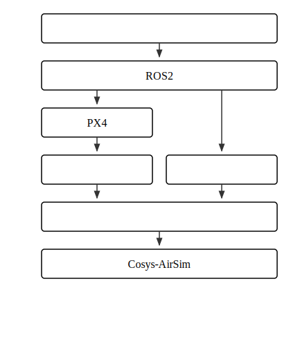
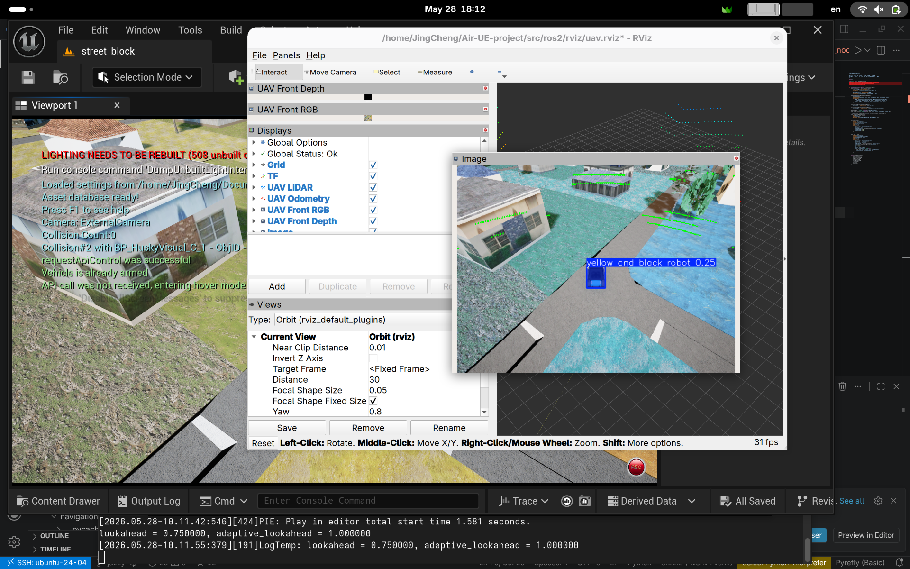

# Air-UE-project

基于 [Cosys-AirSim](https://cosys-lab.github.io/Cosys-AirSim/) 的无人车-无人机空地协同轨迹规划与仿真系统。
<br>
ROS 2 相关内容见 [`src/ros2/README.md`](src/ros2/README.md)，节点、话题和 demo 说明见 [`coordination/README.md`](src/ros2/src/coordination/README.md)。

## 技术方案

系统采用“控制系统 - ROS 2 - PX4/车辆驱动 - 软件兼容层 - Cosys-AirSim”分层架构，通过状态机组织远距离行驶、起飞、末端配送、动态回收和转场流程。

<p align="center">
  
</p>

- **远距离导航与避障**：GPS 提供目标驱动巡航，Nav2/DWB（DWA）基于局部代价地图生成避障速度指令；三维 LiDAR 点云经高度筛选和二维投影转换为 `LaserScan`，提高固定高度飞行时对障碍物的检出能力。
- **凹角脱困**：当 DWA 在凹角障碍前持续停滞时，状态机启用时变人工势场，势场增益随停滞时间二次增长；恢复运动后退出脱困状态，避免势场持续干扰正常巡航。
- **视觉定位**：深度相机结合 YOLOE-26x 开放词汇检测获得无人车目标及其相对位姿，用于目标遮挡恢复和末端接近。
- **动态着陆**：CoNi-MPC 在无人车非惯性坐标系内直接计算无人机姿态控制量，利用 UAV/AGV 里程计和 IMU 完成运动目标跟踪与降落，无需已知目标运动轨迹或持续在线重规划。


## 主要依赖

- Cosys-AirSim UE 仿真环境和 Blocks 工程。
- ROS 2 Jazzy、`colcon`、MAVROS，以及 PX4 SITL；ROS 2 demo 的飞控链路通过 PX4/MAVROS 工作。

## 地图资源
下载并解压到`<项目目录>/Unreal/`
下载链接：[小飞机网盘](https://share.feijipan.com/s/vo5Gu6kN)

## 启动仿真引擎

启动前请将项目根目录的 `settings.json` 放置于 `~/Documents/AirSim/settings.json`。

```bash
./run_engine.sh
```

### 无人机

```bash
cp src/test/settings/settings_drone.json ~/Documents/AirSim/settings.json
# 启动 UE 并点击 Play
python3 src/test/drone/check_connection.py
python3 src/test/drone/hello_drone.py
python3 src/test/drone/keyboard_drone.py
```

`keyboard_drone.py` 使用键盘控制无人机

### 无人车

```bash
cp src/test/settings/settings_agv.json ~/Documents/AirSim/settings.json
# 启动 UE 并点击 Play
python3 src/test/agv/check_connection.py
python3 src/test/agv/hello_agv.py
python3 src/test/agv/keyboard_agv.py
```

`keyboard_agv.py` 使用键盘控制无人车

## ROS 2

ROS 2 工作区的安装、wrapper 话题、构建方式和 demo 命令集中在 [`src/ros2/README.md`](src/ros2/README.md)。coordination 的三个主要入口如下：

```bash
cd src/ros2
source ../../.venv/bin/activate
source /opt/ros/jazzy/setup.bash
colcon build --symlink-install
source install/setup.bash

ros2 launch coordination coordination_demo.launch.py
ros2 launch coordination mpc_landing_demo.launch.py
ros2 launch coordination coordination_rtl_demo.launch.py
```

三个launch不能同时使用，详见 coordination README。

## 注意

- AirSim 的 `SimMode` 只能选择一个；双载具实时协同时，应使用两个 UE 实例和不同 RPC 端口，或使用 `agv_actor_sim` 在单个 UAV 实例中模拟运动学 AGV。
- `agv_actor_sim` 的 AGV 是通过 `simSetObjectPose` 运动学移动的 UE actor，不是 PhysX/Chaos 车辆，不能产生真实接触力。
- UAV 位置由 AirSim/PX4 飞控链路持续更新；“无人机落在 AGV 上并跟车”不能依赖 UE 摩擦，而要使用 coordination 中的状态机和运动学覆盖机制。
- ROS 2 话题的命名空间必须和 wrapper、launch 的配置一致，尤其是 `/uav`、`/sim_ugv` 和 `/mavros` 前缀。

## 运行效果

<table>
  <tr>
    <td align="center"></td>
    <td align="center"></td>
    <td align="center"></td>
  </tr>
  <tr>
    <td align="center">无人机执行避障并前往目标点。</td>
    <td align="center">无人机在行进中的无人车上完成动态降落。</td>
    <td align="center">YOLOE-26 对目标进行开放词汇识别。</td>
  </tr>
</table>

## 说明
部分代码来源或借鉴于第三方仓库例如Cosys-Airsim、CoNi-MPC等,版权属于原作者。
